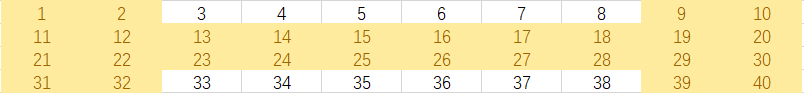

### 试题A
**【题目】**　组队
	作为篮球队教练，你需要从以下名单中选出 1 号位至 5 号位各一名球员，组成球队的首发阵容。
	每位球员担任 1 号位至 5 号位时的评分如下表所示。请你计算首发阵容 1号位至 5 号位的评分之和最大可能是多少？


<font color=red>[广度优先搜索 |深度优先搜索|动态规划]</font>

```c++

```


### 试题Ｂ

**【题目】** 年号字串

​	明用字母 `A` 对应数字 1，`B` 对应 2，以此类推，用 `Z` 对应 26。对于 27以上的数字，小明用两位或更长位的字符串来对应，例如 `AA` 对应 27，`AB` 对
​	应 28，`AZ `对应 52，`LQ `对应 329。请问 2019 对应的字符串是什么？

**【答案提交】**

​	<font size=2>这是一道结果填空的题，你只需要算出结果后提交即可。本题的结果为一
​	个大写英文字符串，在提交答案时只填写这个字符串，注意全部大写，填写多
​	余的内容将无法得分。</font>

<font color=red>[递归|栈]</font>

```c++
#include<iostream>
#include<stack>//栈实现
using namespace std;

//递归实现
void fun(int n){
    if(n!=0){
        fun(n/26);
        printf("%c",n%26+'A'-1);
    }
}

int main(){
    int n=2019;
    stack<int>st;

    fun(n);
    cout<<endl;
    
    //栈实现
    while(n){
        st.push(n);
        n/=26;
    }
    while(!st.empty()){
        printf("%c",'A'+st.top()%26-1);
        st.pop();
    }
    return 0;
}

```


### 试题C

**【题目】**　数列求值

​	给定数列 1, 1, 1, 3, 5, 9, 17, …，从第 4 项开始，每项都是前 3 项的和。求第 20190324 项的最后 4 位数字。

**【答案提交】**
	<font size=2>这是一道结果填空的题，你只需要算出结果后提交即可。本题的结果为一
个 4 位整数（提示：答案的千位不为 0） ，在提交答案时只填写这个整数，填写多余的内容将无法得分。</font>

<font color=red>[动态规划|斐波那契数]</font>

```c++
#include<iostream>
#include<vector>
using namespace std;

int main(){
    int n;
    cin>>n;
    vector<int>vi(n);
    vi[0]=1,vi[1]=1,vi[2]=1;
    for(int i=3;i<vi.size();i++){
        vi[i]=(vi[i-1]+vi[i-2]+vi[i-3])%10000;
    }
    cout<<vi.back();
    return 0;
}
```


### 试题D

**【题目】** 数的分解

​	把 2019分解成 3个各不相同的正整数之和，并且要求每个正整数都不包
​	含数字2和4，一共有多少种不同的分解方法？
​	注意交换 3个整数的顺序被视为同一种方法，例如 `1000+1001+18`和
​	`1001+1000+18`被视为同一种。

<font size=2>【答案提交】</font>
​	<font size=2>这是一道结果填空的题，你只需要算出结果后提交即可。本题的结果为一
个整数，在提交答案时只填写这个整数，填写多余的内容将无法得分。</font>


> 暴力解法，直接三重循环，再每次判断是否会被`2`或`4`整除.

<font color=red>[数论]</font>

```c++
#include<iostream>

using namespace std;

bool check(int a) {
	int n = a, t = 0;
	while (n) {
		t = n % 10;
		n /= 10;
		if (t == 2 || t == 4)return false;
	}
	return true;
}

int main() {
	int ans = 0;
	for (int i = 1; i < 2017; i++) {
		if (!check(i))continue;
		for (int j = i+1; j < 2018; j++) {
			if (!check(j))continue;
			for (int k = j+1; k < 2019; k++) {
				if (!check(k))continue;
				if (i + j + k == 2019) {
					ans++;
				}
			}
		}
	}
	cout << ans << endl;
	getchar();
	return 0;
}
```

### 试题E

**【题目】** 迷宫

​	下图给出了一个迷宫的平面图，其中标记为 1 的为障碍，标记为 0 的为可以通行的地方。

```
010000
000100
001001
110000
```

​	迷宫的入口为左上角，出口为右下角，在迷宫中，只能从一个位置走到这个它的上、下、左、右四个方向之一。
​	对于上面的迷宫，从入口开始，可以按`DRRURRDDDR `的顺序通过迷宫，一共 10 步。其中 D、U、L、R 分别表示向下、向上、向左、向右走。
​	对于下面这个更复杂的迷宫（30 行 50 列） ，请找出一种通过迷宫的方式，其使用的步数最少，在步数最少的前提下，请找出字典序最小的一个作为答案。
​	请注意在字典序中D<L<R<U。（如果你把以下文字复制到文本文件中，请务必检查复制的内容是否与文档中的一致。在试题目录下有一个文件 `maze.txt`，内容与下面的文本相同）

<font size=2>01010101001011001001010110010110100100001000101010
00001000100000101010010000100000001001100110100101
01111011010010001000001101001011100011000000010000
01000000001010100011010000101000001010101011001011
00011111000000101000010010100010100000101100000000
11001000110101000010101100011010011010101011110111
00011011010101001001001010000001000101001110000000
10100000101000100110101010111110011000010000111010
00111000001010100001100010000001000101001100001001
11000110100001110010001001010101010101010001101000
00010000100100000101001010101110100010101010000101
11100100101001001000010000010101010100100100010100
00000010000000101011001111010001100000101010100011
10101010011100001000011000010110011110110100001000
10101010100001101010100101000010100000111011101001
10000000101100010000101100101101001011100000000100
10101001000000010100100001000100000100011110101001
00101001010101101001010100011010101101110000110101
11001010000100001100000010100101000001000111000010
00001000110000110101101000000100101001001000011101
10100101000101000000001110110010110101101010100001
00101000010000110101010000100010001001000100010101
10100001000110010001000010101001010101011111010010
00000100101000000110010100101001000001000000000010
11010000001001110111001001000011101001011011101000
00000110100010001000100000001000011101000000110011
10101000101000100010001111100010101001010000001000
10000010100101001010110000000100101010001011101000
00111100001000010000000110111000000001000000001011
10000001100111010111010001000110111010101101111000</font>

> 典型的广度优先搜索题目
>
> * <font color=red>[多源BFS]</font>
> * 类似的题在`leetcode`上有[542. 01 矩阵](https://leetcode-cn.com/problems/01-matrix/)、[1162. 地图分析](https://leetcode-cn.com/problems/as-far-from-land-as-possible/)
>   * 广度优先搜索一般用队列的形式实现(也有用栈实现的)，在数据结构中和树的层序遍历差不多.
>
> 思路：
>
> 1. 把`x`、`y`和其他部分放到结构体中，`x`和`y`主要时记录坐标.
> 2. 首先把第一个节点放到队列中，进入循环.
> 3. 在每一次`while`循环时，把队头的元素取出
>    * 队头元素当作扩散点，每一次取出的这个点，需要向四个方向（或者其他固定方向）扩散.【四个方向通常放到一个数组中】
>    * 条件部分：判定是否越界和其他满足题目要求的条件.
>      * 如果满足条件式（指没有发生越界和没有其他条件下），下一个坐标入队.
>    * 删除每次进行`while`循环时队列中的队头元素.

```c++
#include <iostream>
#include <queue>
using namespace std;

int m, n;
char map[50][50];
bool vis[50][50];//做记录
int dir[4][2] = {{1,0},{0,-1}, {0,1}, {-1,0}};
char dirc[4] = {'D', 'L', 'R', 'U'};

struct node{
    int x;
    int y;
    int step;
    string str;
    node(int xx, int yy, int ss, string s):x(xx),y(yy),step(ss),str(s){}//初始化
};

void bfs(int x, int y){   
    queue<node> q;
    q.push(node(0, 0, 0, ""));
    vis[0][0]=true;
    while(!q.empty()){
        node now = q.front();
        if(now.x == m-1 && now.y == n-1){//结束条件
            cout<<now.str<<endl;
            cout<<now.step<<endl;
            break;
        }
        q.pop();
        for(int i=0; i<4; i++){//向四周扩散
            int xx=now.x+dir[i][0];
            int yy=now.y+dir[i][1];
            if(!(xx<0 || xx>=m || yy<0 || yy>=n || vis[xx][yy] || map[xx][yy] == '1')){
                q.push(node(xx, yy, now.step+1, now.str+dirc[i]));
                vis[xx][yy]=true;
            }
        }
    }
}

int main(){
    cin>>m>>n;
    for(int i=0; i<m; i++)cin>>map[i];
    bfs(0, 0);
    return 0;
}
```

### 试题F

**【题目】** 特别数的和

​	小明对数位中含有 2、0、1、9 的数字很感兴趣（不包括前导 0） ，在 1 到40 中这样的数包括 1、2、9、10 至 32、39 和 40，共 28 	个，他们的和是 574。
​	请问，在 1 到 n 中，所有这样的数的和是多少？


**【输入格式】**
	输入一行包含两个整数 n。

**【输出格式】**
	输出一行，包含一个整数，表示满足条件的数的和。

**【样例输入】**
	40
**【样例输出】**
	574
**【评测用例规模与约定】**
<font size=2>对于 20% 的评测用例，1 ≤ n ≤ 10。</font>
<font size=2>对于 50% 的评测用例，1 ≤ n ≤ 100。</font>
<font size=2>对于 80% 的评测用例，1 ≤ n ≤ 1000。</font>
<font size=2>对于所有评测用例，1 ≤ n ≤ 10000。</font>

> 和D题目大同小异.
>
> 
>
> <font color=red>[数论]</font>

```c++
#include<iostream>
using namespace std;

bool check(int n){
    int p=n;
    while(n){
        p=n%10;
        if(p==2||p==0||p==1||p==9)
            return true;
        n/=10;
    }
    return false;
}

int main(){
    int n=0,res=0;
    cin>>n;
    for(int i=1;i<=n;i++){
        if(check(i))
            res+=i;
    }
    cout<<res;  
    return 0;
}
```

### 试题G

**【题目】** 完全二叉树的权值

​	给定一棵包含 N 个节点的完全二叉树，树上每个节点都有一个权值，按从上到下、从左到右的顺序依次是 A<sub>1</sub> , A<sub>2</sub> , ··· A<sub>N</sub> ，如下图所示：

<font color=red>图待补</font>

​	现在小明要把相同深度的节点的权值加在一起，他想知道哪个深度的节点权值之和最大？如果有多个深度的权值和同为最大，请你输出其中最小的深度。

<font size=2>注：根的深度是 1。</font>

**【输入格式】**
	第一行包含一个整数 N。
	第二行包含 N 个整数 A<sub>1</sub> , A<sub>2</sub> , ··· A<sub>N</sub> 。

**【输出格式】**
	输出一个整数代表答案。

**【样例输入】**
7
1 6 5 4 3 2 1

**【样例输出】**

2


**【评测用例规模与约定】**
<font size=2>对于所有评测用例，1 ≤ N ≤ 100000，−100000 ≤ A <sub>i</sub>≤ 100000。</font>

```

```


### 试题H

**【题目】** 等差数列

​	数学老师给小明出了一道等差数列求和的题目。但是粗心的小明忘记了一部分的数列，只记得其中N 个整数。

​	现在给出这N 个整数，小明想知道包含这N 个整数的最短的等差数列有几项？

**【输入格式】**
	输入的第一行包含一个整数N。
	第二行包含`N` 个整数A<sub>1</sub>, A<sub>2</sub>, &bull;&bull;&bull;, A<sub>N</sub> (注意A<sub>1</sub>~ A<sub>N</sub> 并不一定是按等差数列中的顺序给出)

**【输出格式】**
	输出一个整数表示答案。

**【样例输入】**

```
5
2 6 4 10 20
```

**【样例输出】**

```
10
```

**【样例说明】**
	<font size=2>包含2、6、4、10、20 的最短的等差数列是2、4、6、8、10、12、14、16、18、20。</font>

**【评测用例规模与约定】**
<font size=2>	对于所有评测用例，2≤N≤100000, 0≤A<sub>i</sub>≤10<sup>9</sup> .</font>

> 求任意等差数列中的长度，我们从一个公式中可以推导：a<sub>m</sub> = a<sub>n</sub> + (m - n)&times;d，在这里 (m - n +1) 可以刚好为结果，设 `len` = m - n +1.
>
> 经过变形有： `len` = (a<sub>m</sub> - a<sub>n</sub>)/d +1，在这里面 a<sub>m</sub> 和 a<sub>n</sub> 都是可以得到，当 d 越大时，`len`越小.
>
> 

```c++
#include<iostream>
#include<algorithm>
#include<vector>
using namespace std;

int gcd(int a,int b){return b>0?gcd(b,a%b):a;}

int main(){
	int N;
	cin>>N;
    vector<int>ar(N);
    for(int i=0;i<N;i++)cin>>ar[i];
	sort(ar.begin(),ar.end());
    int d=0;
    for(int i=1;i<N;i++){
        d=gcd(d,ar[i]-ar[0]);
    }
    cout<<d<<endl;
    if(d)cout<<(ar[N-1]-ar[0])/d+1;
    else cout<<N;
	return 0;
}
```

> > > > > > > > > > > 待验证

```c++
#include<iostream>
#include<algorithm>
#include<vector>

#define INT_MAX 10e8;

using namespace std;


int algo(vector<int>&v){
    sort(v.begin(),v.end());
    int d=INT_MAX;
    int si=v.size()-1,len=0;
    for(int i=1;i<=si;i++){
        d=min(d,v[i]-v[i-1]);
    }
    len=(v[si]-v[0])/d;
    return len+1;
}


int main(){
    int n;
    cin>>n;
    vector<int>s(n);
    for(int i=0;i<n;i++)cin>>s[i];
    cout<<algo(s);
    getchar();
    return 0;
}
```


### 试题I

**【题目】** 后缀表达式

给定 N 个加号、M 个减号以及 N + M + 1 个整数 A 1 ,A 2 ,··· ,A N+M+1 ，小明想知道在所有由这 N 个加号、M 个减号以及 N + M +1 个整数凑出的合法的后缀表达式中，结果最大的是哪一个？请你输出这个最大的结果。

例如使用1 2 3 + -，则 “2 3 + 1 -” 这个后缀表达式结果是 4，是最大的。

【输入格式】

```
	`第一行包含两个整数 N 和 M。`
	`第二行包含 N + M + 1 个整数 A 1 ,A 2 ,··· ,A N+M+1 。`
```

【输出格式】

```
	`输出一个整数，代表答案。`
```

【样例输入】

```
	`1 1`
	`1 2 3`
```

【样例输出】

```
	`4`
```

【评测用例规模与约定】
	对于所有评测用例，0 ≤ N, M ≤ 100000，−10 <sup>9</sup> ≤ A <sub>i</sub> ≤ 10<sup>9</sup> 。

<font color=red>[贪心|二叉树|后缀表达式]</font>

> 首先我们要知道什么是后缀表达式：
>
> ​	如：中缀表达式为 `1-3+4`，用后缀表达式表示为` 1 3 - 4 +`，用前缀表达式为：`+ - 1 3 4`
>
> ​	【在计算机中，三种表达式都可以用栈的形式来表示】
>
> 思路：
>
> 1. 我们可以先从最小的负数开始变成正数(最小的负数变成正数后就是负数中最大的数)，在每次变成正数时，会使用一个负号.
>
>    a. 如果负号没有剩余，那么结果就是所有数之和.
>
>    b. 如过负号有剩余，我们可以确定数组中所有负数都变成了正数，那么就需要把最小的数再变成负数，然后才是求和得到结果.
>

```c++
#include<iostream>
#include<algorithm>
#include<vector>
using namespace std;

int main() {
	//N为加号，M为减号
	int N = 0, M = 0;
	cin >> N >> M;
	vector<int>vi(N + M + 1);
	for (int i = 0; i < vi.size(); i++) {
		cin >> vi[i];
	}
	//先排一次序，使用负号，把最小的变成正数
	sort(vi.begin(), vi.end());
	for (int i = 0; i < vi.size() && M >0;  i++) {
		if (vi[i] < 0) {
			vi[i] = -vi[i], M--;
		}
	}
	//再排一次序，如果负号还存在，把最小的变成负号
	sort(vi.begin(), vi.end());
	if (M > 0) {
		for (int i = 0; i < vi.size()&&M>0; i++,M--) {
			vi[i] = -vi[i];
		}
	}
	int sum = 0;
	for (int i = 0; i < vi.size(); i++)sum += vi[i];
	cout << sum;
	return 0;
}
```


### 试题 J

**【题目背景】**
<font size=2>在游戏《星际争霸 II》中，高阶圣堂武士作为星灵的重要 `AOE` 单位，在
游戏的中后期发挥着重要的作用，其技能”灵能风暴“可以消耗大量的灵能对
一片区域内的敌军造成毁灭性的伤害。经常用于对抗人类的生化部队和虫族的
刺蛇飞龙等低血量单位。</font>

【问题描述】
<font size=2>你控制着 n 名高阶圣堂武士，方便起见标为 1, 2, · · · , n。每名高阶圣堂武士
需要一定的灵能来战斗，每个人有一个灵能值 a<sub>i</sub> 表示其拥有的灵能的多少（a<sub>i</sub>
非负表示这名高阶圣堂武士比在最佳状态下多余了 a<sub>i</sub> 点灵能，a<sub>i</sub> 为负则表示这
名高阶圣堂武士还需要 −a<sub>i </sub>点灵能才能到达最佳战斗状态）。现在系统赋予了
你的高阶圣堂武士一个能力，传递灵能，每次你可以选择一个 i ∈ [2, n − 1]，若
a<sub>i</sub> ≥ 0 则其两旁的高阶圣堂武士，也就是 i − 1、i + 1 这两名高阶圣堂武士会从
i 这名高阶圣堂武士这里各抽取 a<sub>i</sub> 点灵能；若 a<sub>i</sub> < 0 则其两旁的高阶圣堂武士，
也就是 i − 1, i + 1 这两名高阶圣堂武士会给 i 这名高阶圣堂武士 −a<sub>i</sub> 点灵能。形
式化来讲就是 a<sub>i</sub>−1+ = a<sub>i</sub>, a<sub>i</sub>+1+ =a<sub>i</sub>, a<sub>i</sub>− = 2a<sub>i</sub>。
灵能是非常高效的作战工具，同时也非常危险且不稳定，一位高阶圣堂
武士拥有的灵能过多或者过少都不好，定义一组高阶圣堂武士的不稳定度为
max<sub>i=1</sub><sup>n</sup>|a<sub>i</sub>|，请你通过不限次数的传递灵能操作使得你控制的这一组高阶圣堂武
士的不稳定度最小。</font>

**【输入格式】**<font size=2>本题包含多组询问。输入的第一行包含一个正整数 T 表示询问组数。
接下来依次输入每一组询问。
每组询问的第一行包含一个正整数 n，表示高阶圣堂武士的数量。
接下来一行包含 n 个数 a<sub>1</sub>, a<sub>2</sub>, · · · ,a<sub>n</sub>。</font>


**【输出格式】**
<font size=2>输出 T 行。每行一个整数依次表示每组询问的答案。</font>
【样例输入】

```
3
3
5 -2 3
4
0 0 0 0
3
1 2 3
```

**【样例输出】**

```
3
0
3
```

**【样例说明】**
	<font size=2>对于第一组询问：
对 2 号高阶圣堂武士进行传输操作后 a<sub>1</sub> = 3，a<sub>2</sub> = 2，a<sub>3</sub> = 1。答案为 3。
对于第二组询问：
这一组高阶圣堂武士拥有的灵能都正好可以让他们达到最佳战斗状态。</font>


**【样例输入】**

```
3
4
-1 -2 -3 7
4
2 3 4 -8
5
-1 -1 6 -1 -1
```

**【样例输出】**

```
5
7
4
```

**【样例输入】**
见文件`trans3.in`。
【样例输出】
见文件`trans3.ans`。


**【数据规模与约定】**
<font size=2>对于所有评测用例，T ≤ 3，3 ≤ n ≤ 300000，|a<sub>i</sub> | ≤ 109。</font>

评测时将使用 25 个评测用例测试你的程序，每个评测用例的限制如下：
评测用例编号 n |a<sub>i</sub>

> | 特殊性质
> 
> 注意：本题输入量较大请使用快速的读入方式。


|          --           |           --            |
| :-------------------: | :---------------------: |
|     1 = 3 ≤ 1000      |           无            |
|    2,3 ≤ 5 ≤ 1000     |           无            |
|  4,5,6,7 ≤ 10 ≤ 1000  |           无            |
|  8,9,10 ≤ 20 ≤ 1000   |           无            |
|    11 ≤ 100 ≤ 109     | 所有 a<sub>i</sub> 非负 |
| 12,13,14 ≤ 100 ≤ 109  |           无            |
|   15,16 ≤ 500 ≤ 109   |           无            |
| 17,18,19 ≤ 5000 ≤ 109 |           无            |
|    20 ≤ 5000 ≤ 109    | 所有 a<sub>i</sub> 非负 |
|   21 ≤ 100000 ≤ 109   | 所有 a<sub>i</sub> 非负 |
| 22,23 ≤ 100000 ≤ 109  |           无            |
| 24,25 ≤ 300000 ≤ 109  |           无            |


<font color=red>[贪心|前缀和|奇偶处理|快读]</font>

思路：

> 从题目中我们可以的得出 max={|a<sub>1</sub>|, |a<sub>2</sub>|, |a<sub>2</sub>| &bull;&bull;&bull; |a<sub>n</sub>|}.
>
> 我们所求的是`max`中的最大值中的最小值.
>
> 用前缀和表示每一个个数：max={|s<sub>1</sub>-s<sub>0</sub>|, |s<sub>2</sub>-s<sub>1</sub>|, &bull;&bull;&bull; |s<sub>n-1</sub>-s<sub>n-1</sub>|}.
>
> 那么问题就转化为：求两个相邻`s`的差的绝对值的最大值的最小值.
>
> * 已知 S<sub>0</sub> 和 S<sub>n</sub> .
>
> * 情况如下：
>
>  1. 如果 s<sub>0</sub> 和 s<sub>n</sub> 刚好为最小值好和最大值（或相反），那么此时就是最优解. 原因如下：
>
>     * 随便设四个点，s<sub>1</sub>, s<sub>2</sub>, s<sub>3</sub>, s<sub>4</sub>, 如果 s<sub>1</sub> < s<sub>3</sub> < s<sub>2</sub> < s<sub>4</sub> 成立，如果交换 s<sub>2</sub> 和 s<sub>3</sub> 的**值**使得四个点满足单调递增，得：s<sub>1</sub>, s<sub>2</sub>', s<sub>3</sub>' s<sub>4</sub>.
>
>     ​	设：L<sub>1</sub>= |s<sub>2</sub> - s<sub>1</sub>|，L<sub>2</sub> = |s<sub>4</sub> - s<sub>3</sub>|，L<sub>1</sub>' = |s<sub>2</sub>' - s<sub>1</sub>|，L<sub>2</sub>' = |s<sub>4</sub> - s<sub>3</sub>'|.
>
>     ​	我们很容易知道原来中间两个值差的绝对值是不变的，从上面列的式子我们可以得到，L<sub>1</sub> &le; L<sub>1</sub>'，L<sub>2</sub> &le; L<sub>2</sub>' .
>
>     
>
>     ​	结论：交换两个值后，这两个值与前(或后)一个点的差会变小或不变.
>     
>     
>     
>     ​	最后**P<sub>1</sub>**：[当 S<sub>0</sub> 和 S<sub>n</sub> 刚好为最小值好和最大值（或相反)，经过再次排序后]，一定会是一组最优解.
>     
>     
>     
> 2. 当`s`本身不是单调序列时.
>
>    * 此时s<sub>0</sub> 和 s<sub>n</sub> 的值一定会在排列后的数组的中间.
>
>    ​	我们可以从`1`中得到**P<sub>1</sub>**结论，总会得到一组最优解法.
>
>    假设：当从s<sub>0</sub> 开始时s<sub>n</sub>结束，每一次跳2个单位时是最优解.
>    
>    我们在横坐标上可以列四个点{1, 2, 3, 4}，如果第一组为｛<1,4>，<2,3>｝，第二组为｛<1,３>，<2,４>｝.
>    
>    |4-2|=3，|3-2|=1.
>    
>    |3-1|=2，|4-2|=2.
>    
>    那么有：set_1={3，１}＝３．set_2={2，２}＝２;
>    
>    很显然：set_2 比 set_1 稳定，那么跳的个数为２为最优解.


```c++
#include <algorithm>
#include <cstring>
#include <iostream>
#include <limits.h>
 
using namespace std;
 
typedef long long LL;
const int N = 300010;
 
int n;
LL sum[N], a[N], S0, Sn;
bool bo[N];
 
//快读
int read(){
    char c;
    int f=1,res=0;
    c=getchar();
    while(c<'0'||c>'9'){if(c=='-')f=-1;c=getchar();}
    while(c>='0'&&c<='9'){res=res*10+c-'0';c=getchar();}
    return res*f;
}

int main(){
    int T=read();
    while (T--){
        n=read();
        sum[0] = 0;

        //前缀和
        for (int i = 1; i <= n; i++){
            sum[i]=read();
            sum[i] += sum[i - 1];
        }
        S0 = sum[0], Sn = sum[n];
        //去重
        if (S0 > Sn)
            swap(S0, Sn);
        //贪心思想
        sort(sum, sum + n + 1);

        //寻找S0和Sn的坐标
        for (int i = 0; i <= n; i++)
            if (S0 == sum[i]){
                S0 = i;
                break;
            }
        for (int i = n; i >= 0; i--)
            if (Sn == sum[i]){
                Sn = i;
                break;
            }
        
        //初始化bo全为0(false)
        memset(bo, 0, sizeof bo);
        int l = 0, r = n;

        //进行跳格子，当S0和Sn不为最小和最大时，从上面找到的S0和Sn下标开始
        //用到bool数组进行标记，去奇偶问题
        for (int i = S0; i >= 0; i -= 2){
            a[l++] = sum[i];
            bo[i] = true;
        }
        for (int i = Sn; i <= n; i += 2){
            a[r--] = sum[i];
            bo[i] = true;
        }
        for (int i = 0; i <= n; i++)
        if (!bo[i]){a[l++] = sum[i];}

        LL res = 0;
        //最后得到结果
        for (int i = 1; i <= n; i++)
        res = max(res, abs(a[i] - a[i - 1]));
        printf("%d\n", res);
    }
    getchar();
    return 0;
}
```


