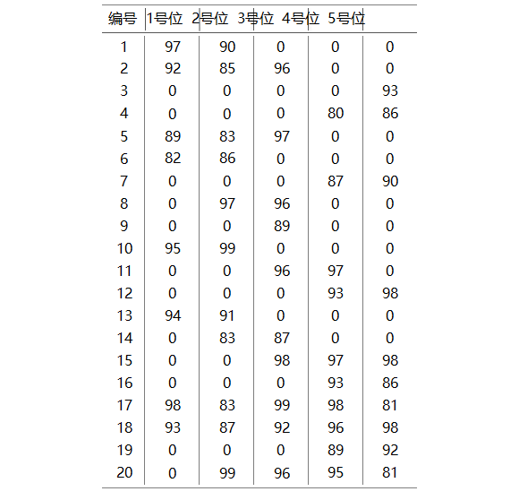

### 试题A
**【题目】**　组队
&nbsp;&nbsp;&nbsp;作为篮球队教练，你需要从以下名单中选出 1 号位至 5 号位
&nbsp;&nbsp;&nbsp;各一名球员，组成球队的首发阵容。
&nbsp;&nbsp;&nbsp;每位球员担任 1 号位至 5 号位时的评分如下表所示。请你计
&nbsp;&nbsp;&nbsp;算首发阵容 1号位至 5 号位的评分之和最大可能是多少？



> 方法一：观察法
>可直接从表中观察出答案. 


> 提升：如果表不固定，求最后的的最大值.


### 试题B

**【题目】** 年号字串

​	小明用字母 `A`对应数字 1`B`对应 2，以此类推，用 `Z`对应 26。对于 27
​	以上的数字，小明用两位或更长位的字符串来对应，例如 `AA`对应27，`AB`对
​	应`28`，`AZ`对应52，`LQ`对应329。
​	请问2019对应的字符串是什么？


### 试题C

**【题目】** 数列求值
	给定数列1,1,1,3,5,9,17,…，从第4项开始，每项都是前3项的和。求
	第20190324项的最后4位数字。

> 斐波那契数相同做法，`dp`问题

```c++
#include<iostream>
using namespace std;

const int N = 20190324;
int dp[N] = { 0 };

int main() {
	dp[0] = 1, dp[1] = 1, dp[2] = 1;
	for (int i = 3; i < N; i++) {
		dp[i] = (dp[i - 1] + dp[i - 2] + dp[i - 3])%10000;
	}
	cout << dp[N - 1];
	getchar();
	return 0;
}
```


### 试题D

**【题目】** 数的分解

​	把 2019分解成 3个各不相同的正整数之和，并且要求每个正整数都不包
​	含数字2和4，一共有多少种不同的分解方法？
​	注意交换 3个整数的顺序被视为同一种方法，例如 `1000+1001+18`和
​	`1001+1000+18`被视为同一种。
<font size=2>【答案提交】</font>
​	<font size=2>这是一道结果填空的题，你只需要算出结果后提交即可。本题的结果为一
个整数，在提交答案时只填写这个整数，填写多余的内容将无法得分。</font>


> 暴力解法，直接三重循环，再每次判断是否会被`2`或`4`整除.


```c++
#include<iostream>

using namespace std;

bool check(int a) {
	int n = a, t = 0;
	while (n) {
		t = n % 10;
		n /= 10;
		if (t == 2 || t == 4)return false;
	}
	return true;
}

int main() {
	int ans = 0;
	for (int i = 1; i < 2017; i++) {
		if (!check(i))continue;
		for (int j = i+1; j < 2018; j++) {
			if (!check(j))continue;
			for (int k = j+1; k < 2019; k++) {
				if (!check(k))continue;
				if (i + j + k == 2019) {
					ans++;
				}
			}
		}
	}
	cout << ans << endl;
	getchar();
	return 0;
}
```


### 试题 J

【题目背景】
<font size=2>在游戏《星际争霸 II》中，高阶圣堂武士作为星灵的重要 `AOE` 单位，在
游戏的中后期发挥着重要的作用，其技能”灵能风暴“可以消耗大量的灵能对
一片区域内的敌军造成毁灭性的伤害。经常用于对抗人类的生化部队和虫族的
刺蛇飞龙等低血量单位。</font>

【问题描述】
<font size=2>你控制着 n 名高阶圣堂武士，方便起见标为 1, 2, · · · , n。每名高阶圣堂武士
需要一定的灵能来战斗，每个人有一个灵能值 a<sub>i</sub> 表示其拥有的灵能的多少（a<sub>i</sub>
非负表示这名高阶圣堂武士比在最佳状态下多余了 a<sub>i</sub> 点灵能，a<sub>i</sub> 为负则表示这
名高阶圣堂武士还需要 −a<sub>i </sub>点灵能才能到达最佳战斗状态）。现在系统赋予了
你的高阶圣堂武士一个能力，传递灵能，每次你可以选择一个 i ∈ [2, n − 1]，若
a<sub>i</sub> ≥ 0 则其两旁的高阶圣堂武士，也就是 i − 1、i + 1 这两名高阶圣堂武士会从
i 这名高阶圣堂武士这里各抽取 a<sub>i</sub> 点灵能；若 a<sub>i</sub> < 0 则其两旁的高阶圣堂武士，
也就是 i − 1, i + 1 这两名高阶圣堂武士会给 i 这名高阶圣堂武士 −a<sub>i</sub> 点灵能。形
式化来讲就是 a<sub>i</sub>−1+ = a<sub>i</sub>, a<sub>i</sub>+1+ =a<sub>i</sub>, a<sub>i</sub>− = 2a<sub>i</sub>。
灵能是非常高效的作战工具，同时也非常危险且不稳定，一位高阶圣堂
武士拥有的灵能过多或者过少都不好，定义一组高阶圣堂武士的不稳定度为
max<sub>i=1</sub><sup>n</sup>|a<sub>i</sub>|，请你通过不限次数的传递灵能操作使得你控制的这一组高阶圣堂武
士的不稳定度最小。</font>

【输入格式】
<font size=2>本题包含多组询问。输入的第一行包含一个正整数 T 表示询问组数。
接下来依次输入每一组询问。
每组询问的第一行包含一个正整数 n，表示高阶圣堂武士的数量。
接下来一行包含 n 个数 a<sub>1</sub>, a<sub>2</sub>, · · · ,a<sub>n</sub>。</font>

【输出格式】
<font size=2>输出 T 行。每行一个整数依次表示每组询问的答案。</font>
【样例输入】

> 3
> 3
> 5 -2 3
> 4
> 0 0 0 0
> 3
> 1 2 3


【样例输出】

> 3
> 0
> 3

【样例说明】
<font size=2>对于第一组询问：
对 2 号高阶圣堂武士进行传输操作后 a<sub>1</sub> = 3，a<sub>2</sub> = 2，a<sub>3</sub> = 1。答案为 3。
对于第二组询问：
这一组高阶圣堂武士拥有的灵能都正好可以让他们达到最佳战斗状态。</font>

【样例输入】

> 3
> 4
> -1 -2 -3 7
> 4
> 2 3 4 -8
> 5
> -1 -1 6 -1 -1

【样例输出】

> 5
> 7
> 4

【样例输入】
见文件`trans3.in`。
【样例输出】
见文件`trans3.ans`。

【数据规模与约定】
<font size=2>对于所有评测用例，T ≤ 3，3 ≤ n ≤ 300000，|a<sub>i</sub> | ≤ 109。</font>

评测时将使用 25 个评测用例测试你的程序，每个评测用例的限制如下：
评测用例编号 n |a<sub>i</sub>

> | 特殊性质
> 1 = 3 ≤ 1000 无
> 2,3 ≤ 5 ≤ 1000 无
> 4,5,6,7 ≤ 10 ≤ 1000 无
> 8,9,10 ≤ 20 ≤ 1000 无
> 11 ≤ 100 ≤ 109 所有 a<sub>i</sub> 非负
> 12,13,14 ≤ 100 ≤ 109 无
> 15,16 ≤ 500 ≤ 109 无
> 17,18,19 ≤ 5000 ≤ 109 无
> 20 ≤ 5000 ≤ 109 所有 a<sub>i</sub> 非负
> 21 ≤ 100000 ≤ 109 所有 a<sub>i</sub> 非负
> 22,23 ≤ 100000 ≤ 109 无
> 24,25 ≤ 300000 ≤ 109 无
> 注意：本题输入量较大请使用快速的读入方式。


> 求解方法：
>
> ​	求 max={|a<sub>1</sub>|，|a<sub>2</sub>|，&bull;&bull;&bull; ，|a<sub>n</sub>|}.
>
> ​	用前缀和表示: max={|S<sub>1</sub> - S<sub>0</sub>|，|S<sub>2</sub> - S<sub>1</sub>|，|S<sub>3</sub> - S<sub>2</sub>|，&bull;&bull;&bull;，|S<sub>n</sub> - S<sub>n-1</sub>|}.
>
> 
>
> ​	

### 


